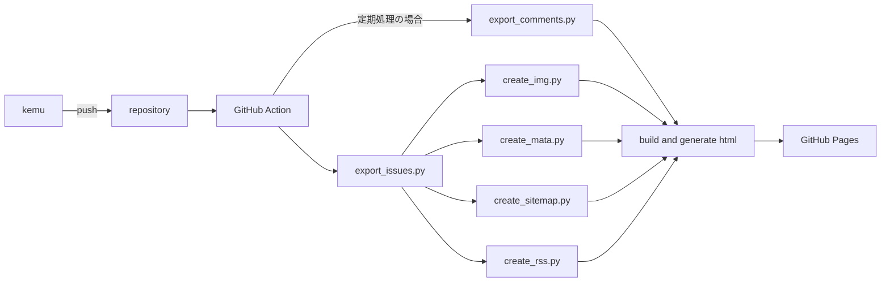
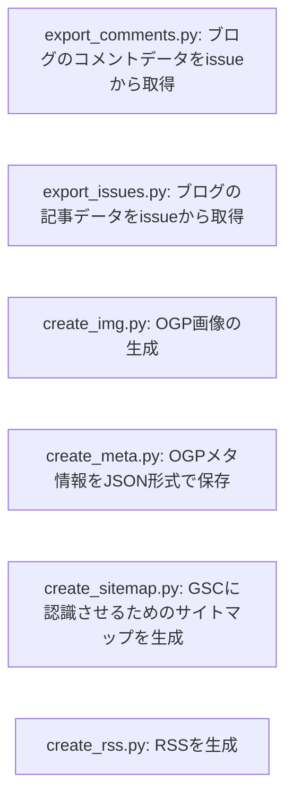

# trash-box.dev/tech

- npm v8.3.1
- node: v16.14.0
- python: 3.10
- url: https://trash-box.dev/tech/
- doc: https://trash-box.dev/tech/doc/

```mermaid
graph LR;
	action[GitHub Action]
	pages[GitHub Pages]
	deploy[build and generate html]
	kemu --push--> repository --> action
	action --> export_issues.py
	action --定期処理の場合--> export_comments.py --> deploy
	export_issues.py --> create_img.py --> deploy
	export_issues.py --> create_mata.py --> deploy
	export_issues.py --> create_sitemap.py --> deploy
	export_issues.py --> create_rss.py --> deploy
	deploy --> pages
```

```mermaid
graph LR;
	export_comments_description[export_comments.py: ブログのコメントデータをissueから取得]
	export_issues_description[export_issues.py: ブログの記事データをissueから取得]
	create_img_description[create_img.py: OGP画像の生成]
	create_mata_description[create_meta.py: OGPメタ情報をJSON形式で保存]
	create_sitemap_description[create_sitemap.py: GSCに認識させるためのサイトマップを生成]
	create_rss_description[create_rss.py: RSSを生成]
```
